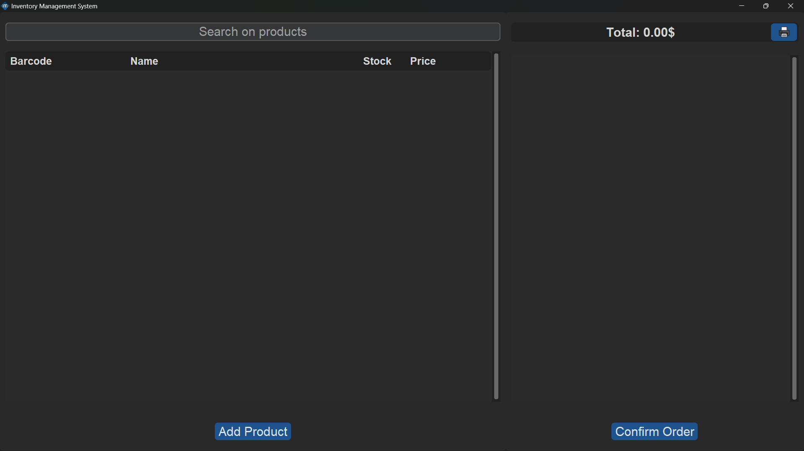
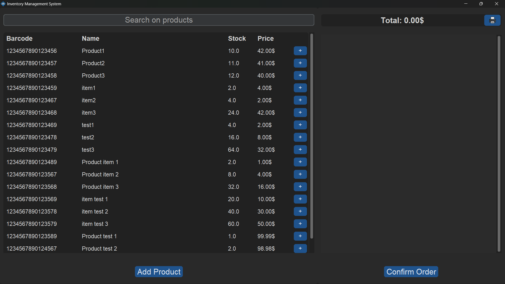
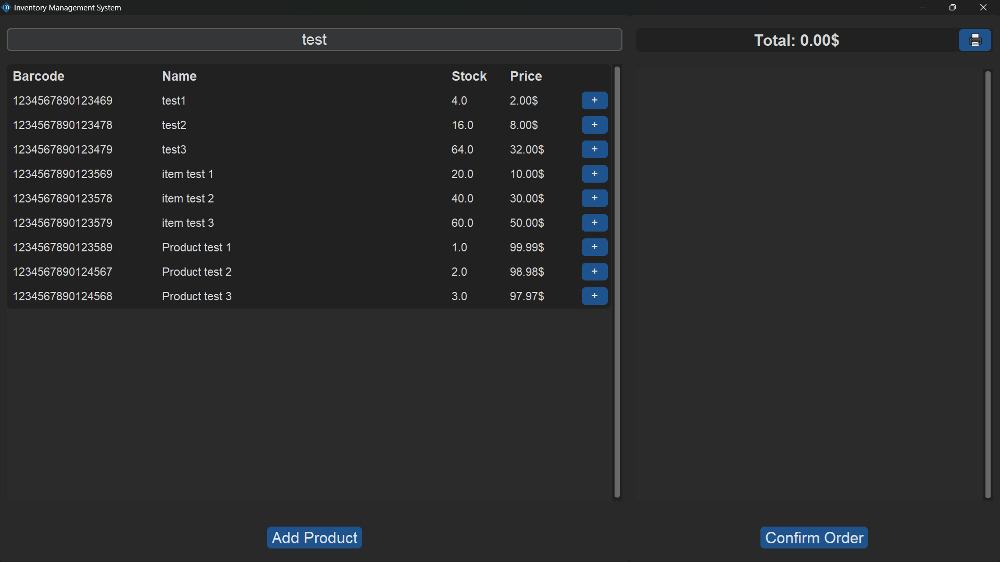
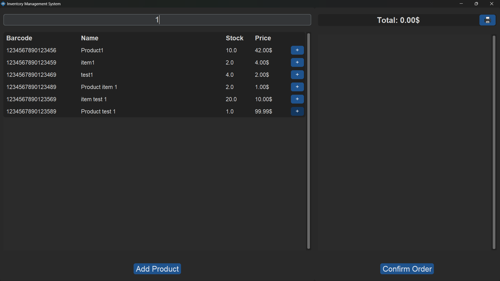
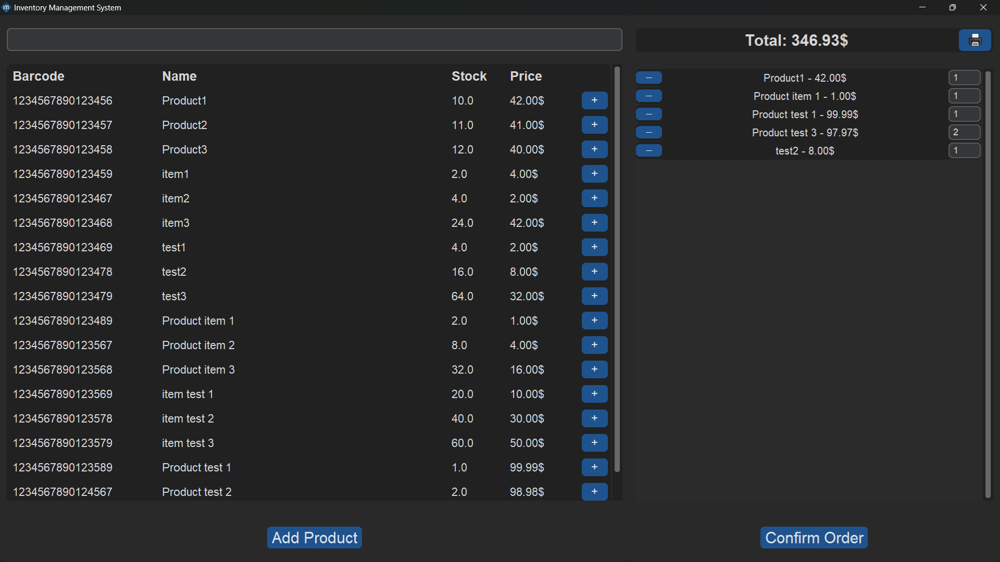
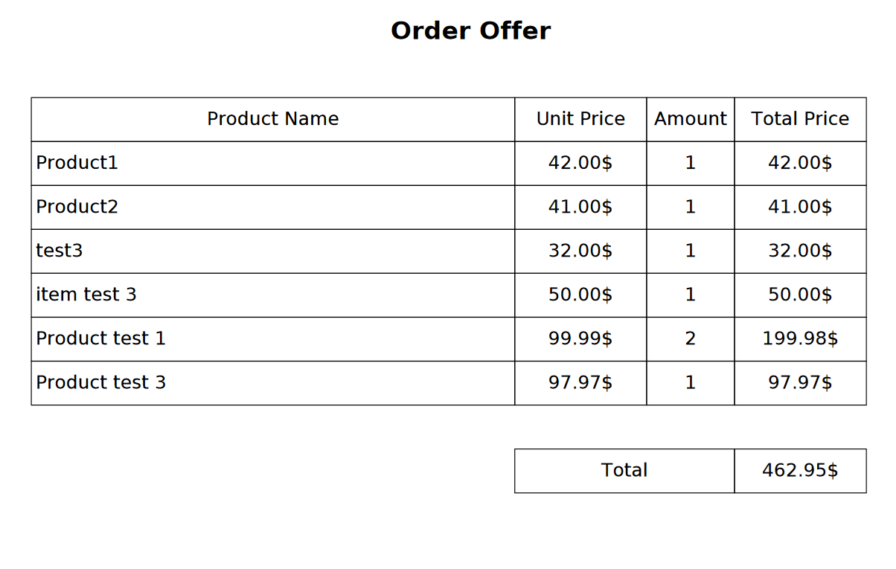

# Inventory Management System

This is a Python-based inventory management application built with **Tkinter** and **CustomTkinter** for the graphical user interface. The app helps manage product inventory, including searching for items, adding items to a basket, and confirming orders. The project uses **SQLite** for data storage and **Pillow** for handling images. The application also supports barcode scanners for quick and efficient product lookup.

## Table of Contents

- [English Version](#english-version)
  - [Features](#features)
  - [Screenshots](#screenshots)
  - [Installation](#installation)
  - [Usage](#usage)
  - [Contact](#contact)
- [Türkçe Versiyon](#türkçe-versiyon)
  - [Özellikler](#özellikler)
  - [Ekran görüntüleri](#ekran-görüntüleri)
  - [Kurulum](#kurulum)
  - [Kullanım](#kullanım)
  - [İletişim](#iletişim)
- [Contributing](#contributing)
- [License](#license)

## English Version

### Features

- **Search Products:** Search for products by name or barcode.
- **Add Products to Basket:** Select products and add them to a virtual shopping basket.
- **Confirm Orders:** Complete transactions by confirming orders.
- **Print Basket:** Print the current basket for record-keeping.
- **Idle State Handling:** Automatically pauses background tasks after a period of inactivity to save resources.
- **Stock Management:** View, update, and manage product stock information.
- **Barcode Scanner Support:** Quickly look up products using a barcode scanner.

### Screenshots








### Installation

1. **Navigate to the English version directory:**
   ```bash
   cd IM\ English
   ```

2. **Create a virtual environment:**
   ```bash
   python -m venv venv
   ```

3. **Activate the virtual environment:**
   - On Windows:
     ```bash
     venv\Scripts\activate
     ```
   - On macOS and Linux:
     ```bash
     source venv/bin/activate
     ```

4. **Install the required packages:**
   ```bash
   pip install -r requirements.txt
   ```

### Usage

1. **Run the application:**
   ```bash
   python main.py
   ```

2. **Features:**
   - The application window will open with a dark theme.
   - You can manage inventory items through the user interface.
   - Use a barcode scanner to quickly look up products.

### Contact

For support or questions, please contact [chillywq@gmail.com](mailto:chillywq@gmail.com).

## Türkçe Versiyon

### Özellikler

- **Ürün Ara:** Ürünleri isim veya barkod ile ara.
- **Ürünleri Sepete Ekle:** Ürünleri seçip sanal alışveriş sepetine ekle.
- **Sipariş Onayı:** Siparişleri onaylayarak işlemi tamamla.
- **Sepeti Yazdır:** Kaydetme amacıyla mevcut sepeti yazdır.
- **Boşta Kalma Durumu Yönetimi:** Kaynakları korumak için belli bir süre işlem yapılmadığında arka plan görevlerini otomatik olarak duraklatır.
- **Stok Yönetimi:** Ürün stok bilgilerini görüntüle, güncelle ve yönet.
- **Barkod Okuyucu Desteği:** Barkod okuyucu ile ürünleri hızlıca sorgula.


### Ekran görüntüleri

/main_screen.png)
/main_screen1.png)
/search.png)
/search1.png)
/basket.png)
/print.png)

### Kurulum

1. **Türkçe sürüm dizinine gidin:**
   ```bash
   cd IM\ Türkçe
   ```

2. **Sanal ortam oluşturun:**
   ```bash
   python -m venv venv
   ```

3. **Sanal ortamı etkinleştirin:**
   - Windows'ta:
     ```bash
     venv\Scripts\activate
     ```
   - macOS ve Linux'ta:
     ```bash
     source venv/bin/activate
     ```

4. **Gerekli paketleri yükleyin:**
   ```bash
   pip install -r requirements.txt
   ```

### Kullanım

1. **Uygulamayı çalıştırın:**
   ```bash
   python main.py
   ```

2. **Özellikler:**
   - Uygulama penceresi koyu temada açılacaktır.
   - Kullanıcı arayüzü üzerinden envanter öğelerini yönetebilirsiniz.
   - Barkod okuyucu kullanarak ürünleri hızlıca sorgulayabilirsiniz.


### İletişim

Destek veya sorularınız için chillywq@gmail.com adresine e-posta gönderin.

## Contributing

1. Fork the repository.
2. Create a new branch (`git checkout -b feature-branch`).
3. Make your changes.
4. Commit your changes (`git commit -am 'Add new feature'`).
5. Push to the branch (`git push origin feature-branch`).
6. Create a new Pull Request.

## License

This project is licensed under the MIT License - see the [LICENSE](LICENSE) file for details.
